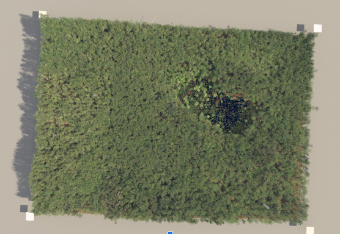

# Airborne Lidar System (ALS) Simulation for Waveform Lidar Data

This directory contains a simulation of **Airborne Lidar System (ALS)** data using the **DIRSIG** (Digital Imaging and Remote Sensing Image Generation) simulation tool. The simulation generates waveform lidar data for a forest scene (**Harvard Forest**).

## Sensor Specifications

- **Virtual Scene**: Harvard Forest
- **Scene Size**: 700m x 500 m
- **Flight Height**: 1000 m
- **Footprint Area**: 1 m² at nadir (directly below the sensor)
- **Pixel Size**: 50 microns
- **Scan Type**: Line scan
- **Transmitter Spectral Line Center**: 1064 nm
- **Transmitter Spectral Line Width**: 1 nm (Gaussian)
- **Pulse Duration**: 16 ns
- **Pulse Energy**: 5 mJ
- **Receiver Spectral Bandpass**: 10 nm (10x transmitter bandpass)
- **Sampling Rate**: 1 ns

## Virtual Scene

  
  
<strong>Figure:</strong> Harvard forest virtual scene

## About the Data

Each `profile_N` (`N` is number of waveforms/profiles obtained) of the simulated data contains the following columns:

- **Column 0**: The bin number
- **Column 1**: The time-of-flight for the bin
- **Column 2**: The total number of photons (summed across all pixels) for the bin
- **Column 3**: The number of photons across all pixels for the bin
- **Column 4**: The minimum number of photons in any pixel for the bin
- **Column 5**: The maximum number of photons in any pixel for the bin

These columns capture the time and photon information for each lidar return, enabling the analysis of the forest structure and vegetation features. Since we are just using a single pixel, a plot of `column 0` vs `column 2` will resemble the waveform lidar data.
